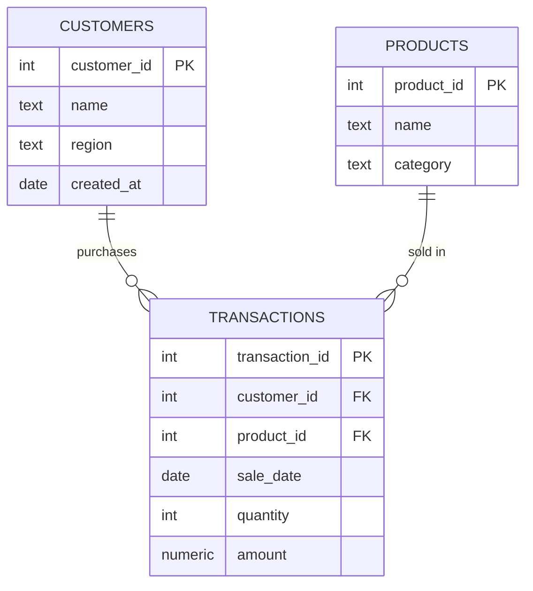

# plsql-window-functions-Ushindi-Victoire

## 📑 Table of Contents
- [📘 Course Information](#-course-information)
- [📌 Business Problem](#-business-problem)
- [🗄️ Database Schema](#️-database-schema)
- [🗂️ ER Diagram](#️-er-diagram)
- [📂 Repository Structure](#-repository-structure)
- [⚙️ How to Run](#️-how-to-run)
- [🔑 Key Queries](#-key-queries)
- [📊 Key Findings](#-key-findings)
- [📜 Academic Integrity](#-academic-integrity)
- [📘 Contribution Guidelines](#-contribution-guidelines)
- [🚀 Clone and Explore](#-clone-and-explore)
- [🙌 Credits](#-credits)
- [📜 License](#-license)

---

## 📘 Course Information
- **Course:** Database Development with PL/SQL (INSY 8311) — Mastery Project  
- **Student:** Ushindi Bihame Victoire  
- **Instructor:** Eric Maniraguha  
- **Date:** 25 Sep - 29 Sep 2025  

---

## 📌 Business Problem
The project analyzes **customer and product performance** using **PL/SQL window functions**:  
- Identify **top products and customers**.  
- Quantify **monthly sales trends & running totals**.  
- Measure **growth over time**.  
- Segment customers into **quartiles for marketing**.  
- Compute **moving averages for forecasting inventory**.  

👉 Helps business improve **marketing** and **inventory management decisions**.  

---

## 🗄️ Database Schema
### Tables
- **customers** → customer_id, name, region, created_at  
- **products** → product_id, name, category  
- **transactions** → transaction_id, customer_id, product_id, sale_date, quantity, amount  

### Constraints & Indexes
- Primary keys on all tables.  
- Foreign keys: `transactions.customer_id → customers`, `transactions.product_id → products`.  
- Indexes on `sale_date`, `customer_id`, `product_id`.  

---

## 🗂️ ER Diagram


---

## 📂 Repository Structure
```
plsql-window-functions-Ushindi-Victoire/
├── schema/
│   └── schema_and_sample_data.sql   # Tables + sample inserts
├── queries/
│   ├── 01_ranking.sql               # Query A - Ranking
│   ├── 02_aggregate_running_total_A.sql  # Query B1 - Running total (ROWS)
│   ├── 02_aggregate_running_total_B.sql  # Query B2 - Running total (RANGE)
│   ├── 03_navigation_lag_lead.sql   # Query C - Month-over-Month growth
│   ├── 04_distribution_ntile_cume_dist.sql # Query D - Quartiles & CUME_DIST
│   ├── 05_moving_avg.sql            # Query E - Moving averages
│   └── revenue_analysis.sql         # Revenue queries (top quartile etc.)
├── analysis/
│   └── analysis.md                  # Descriptive + prescriptive insights
├── screenshots/                     # Query execution results
├── references.md                    # References & academic integrity
├── LICENSE.txt                      # MIT License
└── README.md                        # Project overview
```

---

## ⚙️ How to Run
1. Create database **`plsql_window_db`** in pgAdmin 4 (or use VS Code with PostgreSQL extension).  
2. Run `schema/schema_and_sample_data.sql` to create tables and load data.  
3. Execute queries inside `queries/` to reproduce results.  
4. Compare results with screenshots in `screenshots/`.  

---

## 🔑 Key Queries
- **Ranking:** `ROW_NUMBER()`, `RANK()`, `DENSE_RANK()`, `PERCENT_RANK()` → top customers.  
- **Aggregate:** `SUM()`, `AVG()`, `MIN()`, `MAX()` with `ROWS` & `RANGE` frames → trends & totals.  
- **Navigation:** `LAG()`, `LEAD()` → month-over-month growth.  
- **Distribution:** `NTILE(4)`, `CUME_DIST()` → segment customers into quartiles.  
- **Moving averages:** `AVG() OVER()` → 3-month rolling average.  
- **Revenue analysis:** total revenue, quartiles, % of top 25% contribution.  

---

## 📊 Key Findings
1. **Top 25% of customers contributed ~52.94% of revenue** → loyalty program recommended.  
2. **Seasonal spikes** in April & June → plan inventory ahead.  
3. **Coffee Beans 1kg dominates sales** → allocate more stock to this product.  

---

## 📜 Academic Integrity
All sources are cited in `references.md`.  
All queries and analysis are original.  
No AI-generated text/code copied without attribution.  

---

## 📘 Contribution Guidelines
- Use uppercase SQL keywords & consistent formatting.  
- Add documentation when introducing new queries.  
- Include screenshots for new query results.  
- Follow MIT License rules.  

---

## 🚀 Clone and Explore
```bash
git clone https://github.com/ub-victor/plsql-window-functions-ushindi-Victoire.git
cd plsql-window-functions-ushindi-Victoire
```

---

## 🙌 Credits
- Assignment by **Lecturer Eric Maniraguha**  
- Developed by **Ushindi Bihame Victoire**  
- GitHub: [ub-victor](https://github.com/ub-victor)  

---

## 📜 License
This project is licensed under the **MIT License**.  
See [LICENSE.txt](./LICENSE.txt) for details.